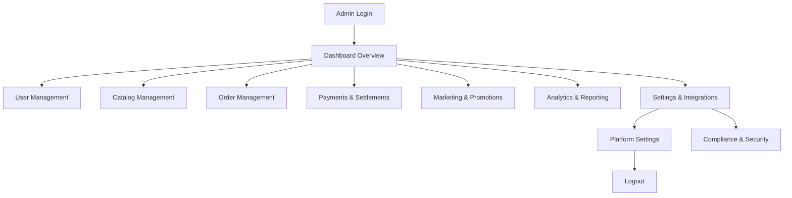
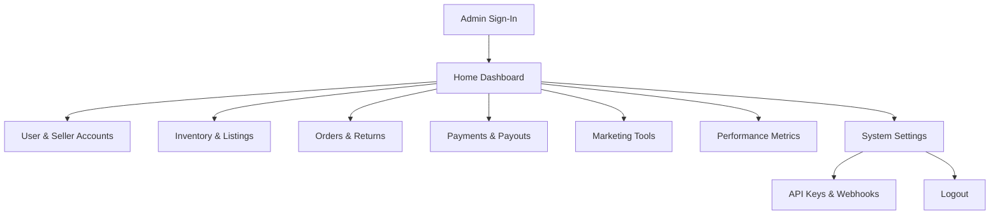
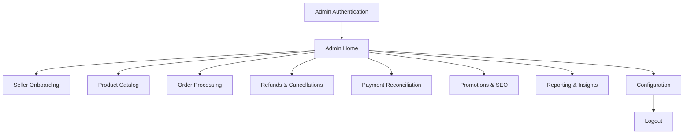
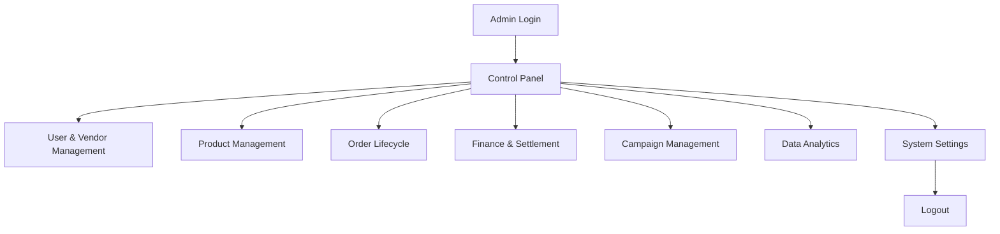
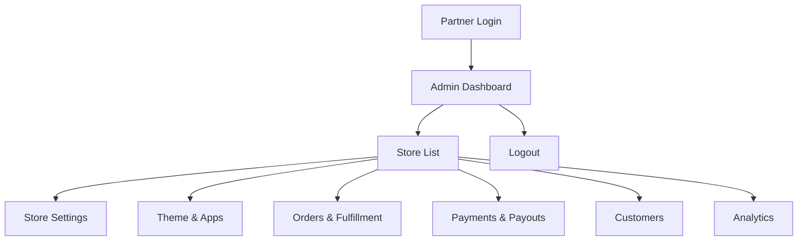
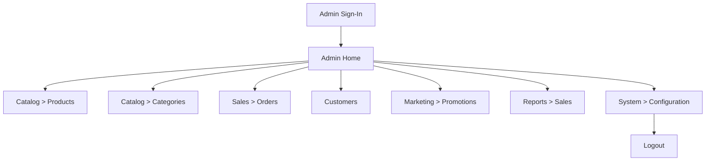
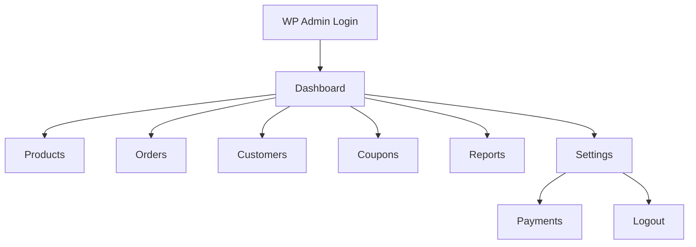
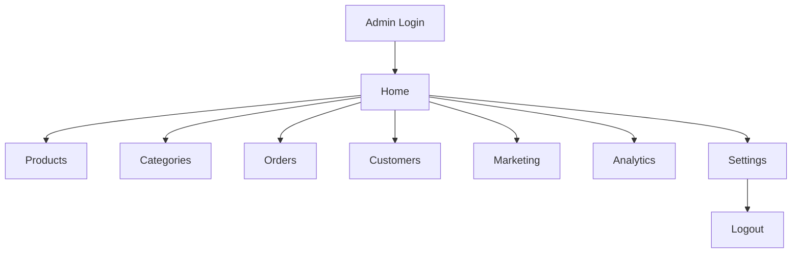
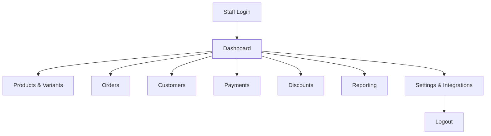

# Admin Journey Mapping

This document outlines the typical **admin (platform operator) journey** for leading e‑commerce platforms. Each section contains a high‑level Mermaid flowchart that captures the page‑by‑page steps an admin performs, from authentication through daily operations to logout.

---
## 1️⃣ Amazon (Marketplace Admin Console)

---
## 2️⃣ eBay (Seller Hub / Admin)

---
## 3️⃣ Walmart (Marketplace Admin)

---
## 4️⃣ Alibaba (Global Trade Admin)

---
## 5️⃣ Shopify (Partner Admin)

---
## 6️⃣ Magento (Backend Admin)

---
## 7️⃣ WooCommerce (WordPress Admin)

---
## 8️⃣ BigCommerce (Control Panel)

---
## 9️⃣ Saleor (Dashboard)

---
## 🔟 Common Admin Tasks Across Platforms
1. **Authentication & MFA** – Secure admin login, often with OTP or SSO.
2. **Dashboard Overview** – Quick glance at key KPIs (sales, traffic, issues).
3. **User / Vendor Management** – Approve, suspend, role‑assign.
4. **Catalog Management** – Bulk edit, import/export, SEO tags.
5. **Order Lifecycle** – View, edit, refund, ship, track.
6. **Payments & Settlements** – Reconcile, payouts, tax reports.
7. **Marketing & Promotions** – Campaign creation, discount codes.
8. **Analytics & Reporting** – Sales, conversion, inventory health.
9. **System Settings** – Integration keys, webhooks, security policies.
10. **Logout / Session Termination** – End secure session.

---
### How to Use This Document
- Compare each step with your **consolidated feature set** to ensure coverage.
- Map the flowchart nodes to micro‑services in the architecture (e.g., Auth Service → Dashboard → Catalog Service, etc.).
- Identify gaps where additional admin tooling (audit logs, role‑based access control) may be required.
- Use the flowcharts as a basis for UI wireframes or API contract definitions.
