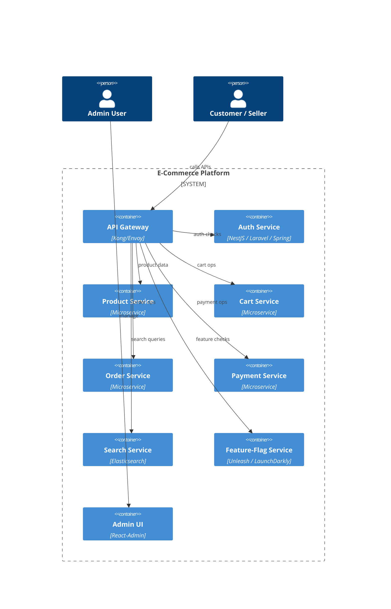

# Scalable System Architecture

## Overview
The platform is built as **independent, horizontally‑scalable micro‑services** that communicate via **event‑driven messaging** and **REST/GraphQL APIs**. Each service can be deployed, autoscaled, and versioned independently while sharing a common **infrastructure layer**.

---

## 1️⃣ High‑Level Component Diagram
```mermaid
flowchart TB
    subgraph "Client Layer"
        Web[Web UI (React/Next.js)]
        Mobile[Mobile App (React Native)]
    end
    subgraph "Edge Layer"
        CDN[CDN (CloudFront/EdgeCache)]
        DNS[DNS (Route53)]
    end
    subgraph "API Gateway"
        GW[API Gateway (Kong/Envoy)]
    end
    subgraph "Core Services"
        Auth[Auth Service]
        Prod[Product Service]
        Cart[Cart Service]
        Order[Order Service]
        Pay[Payment Service]
        Search[Search Service]
        Flag[Feature‑Flag Service]
        Notify[Notification Service]
        Admin[Admin UI]
    end
    subgraph "Data Stores"
        DB[(PostgreSQL)]
        ES[(Elasticsearch)]

## 💰 Cost Optimization

- **Right‑sizing**: Start with burstable instance types (e.g., db.t3.medium) and enable Aurora Serverless autoscaling for compute and storage as load grows.
- **Read replicas**: Deploy a read‑only replica for analytics/search workloads to offload the primary OLTP instance.
- **Cold storage**: Archive orders older than 90 days to S3 Glacier and purge from the primary DB to keep storage costs low.
- **Spot instances for workers**: Run background workers (Kafka consumers, notification processors) on EC2 spot or Fargate Spot to reduce compute spend.
- **Cache‑first strategy**: Leverage Redis for frequently accessed product data and cart state to reduce DB read traffic.
- **Auto‑scaling policies**: Configure Horizontal Pod Autoscaler (CPU > 70 % or queue lag) for all micro‑services; set sensible minimum replicas to avoid cold starts.
- **Serverless functions**: Use Lambda/FaaS for infrequent tasks (e.g., webhook processing, email/SMS sending) to pay per execution.
- **Monitoring & alerts**: Set budget alerts in CloudWatch/Billing to catch cost spikes early.

        ES[(Elasticsearch)]
        Cache[(Redis)]
        Obj[(Object Storage – S3)]
    end
    subgraph "Messaging"
        Kafka[(Kafka Cluster)]
        MQ[(RabbitMQ)]
    end
    subgraph "Observability"
        Prom[Prometheus]
        Graf[Grafana]
        Loki[Log Aggregation]
        OT[OpenTelemetry]
    end
    subgraph "CI/CD & IaC"
        GH[GitHub Actions]
        TF[Terraform]
        Helm[Helm Charts]
    end

    Web --> CDN --> DNS --> GW
    Mobile --> CDN
    GW --> Auth
    GW --> Prod
    GW --> Cart
    GW --> Order
    GW --> Pay
    GW --> Search
    GW --> Flag
    GW --> Notify
    Admin --> GW
    Auth --> DB
    Prod --> DB
    Cart --> Cache
    Order --> DB
    Order --> Kafka
    Pay --> Obj
    Search --> ES
    Flag --> DB
    Notify --> MQ

    Kafka --> Order
    MQ --> Notify

    GH --> TF
    TF --> AWS
    TF --> GCP
    TF --> Azure

    Prom --> Graf
    Loki --> Graf
    OT --> Graf
```
---

## 2️⃣ Service Design Patterns
| Pattern | Description |
|---|---|
| **API‑Gateway** | Central entry point, request routing, rate limiting, JWT validation, TLS termination. |
| **Stateless Services** | All services keep no session state; session data lives in Redis or DB. Enables easy horizontal scaling. |
| **Event‑Driven Architecture** | Core domain events (OrderCreated, InventoryUpdated, PaymentSucceeded) are published to Kafka. Consumers react asynchronously, guaranteeing eventual consistency. |
| **CQRS** (Command‑Query Responsibility Segregation) | Write side uses the relational DB (PostgreSQL). Read side for high‑traffic catalogs uses Elasticsearch indexes that are updated via Kafka listeners. |
| **Feature‑Flag Middleware** | Every request passes through a lightweight middleware that fetches flags from the Flag service (cached in Redis). Allows instant enable/disable without redeploy. |
| **Circuit Breaker & Retry** | Critical external calls (payment gateways, third‑party APIs) are wrapped with resilience patterns (e.g., `resilience4j` or `opossum`). |
| **Health‑Check & Liveness Probes** | Each container exposes `/healthz` and `/ready` endpoints for K8s. |
---

## 3️⃣ Scalability Strategies
1. **Horizontal Pod Autoscaling** – K8s scales each service based on CPU/Memory and custom metrics (queue depth, request latency).
2. **Stateless Containers** – Deploy multiple replicas behind the API‑gateway; session data lives in Redis, so any replica can serve any request.
3. **Database Sharding / Read Replicas** – PostgreSQL primary for writes, read‑replicas for analytics and catalog queries. Use logical replication for multi‑region read locality.
4. **Cache‑Aside Pattern** – Frequently accessed product data, price, and inventory are cached in Redis with TTL and invalidated via Kafka events.
5. **Back‑Pressure Handling** – Kafka partitions allow independent consumer scaling. Consumers can increase parallelism by adding more pods.
6. **CDN Edge Caching** – Static assets, product images, and pre‑rendered pages are served from CloudFront/Akamai, reducing origin load.
7. **Rate Limiting & Throttling** – Kong policies enforce per‑IP and per‑user limits, protecting the platform from spikes.
---

## 4️⃣ Observability & Resilience
- **Metrics**: Prometheus collects request latency, error rates, queue lag; Grafana dashboards visualise them.
- **Tracing**: OpenTelemetry propagates trace IDs across services; Zipkin/Jaeger UI shows end‑to‑end request flow.
- **Logging**: Loki aggregates structured JSON logs; alerts on error bursts.
- **Alerting**: Alertmanager triggers Slack/Teams notifications on SLA breaches.
- **Chaos Engineering**: Periodic pod termination or latency injection (LitmusChaos) to verify auto‑recovery.
---

## 5️⃣ CI/CD & IaC Pipeline
```
GitHub Actions
│   ├─ lint / unit tests
│   ├─ build Docker images → ECR / GCR / ACR
│   ├─ push to artifact registry
│   └─ trigger Terraform apply (infra) & Helm upgrade (services)
```
- **Terraform** provisions VPC, RDS, EKS/GKE/AKS, IAM roles, and S3 buckets.
- **Helm charts** manage service deployments, autoscaling rules, config maps, and secrets.
- **Canary Deployments** – use Argo Rollouts or Spinnaker for progressive rollout with automatic rollback on error.
---

## 6️⃣ Security Foundations
- **Zero‑Trust Network** – Services communicate over mTLS via service mesh (Istio/Linkerd).
- **Secrets Management** – HashiCorp Vault or cloud‑native secret stores (AWS Secrets Manager, GCP Secret Manager) provide API keys, DB passwords, and TLS certs.
- **WAF & DDoS Protection** – Cloud‑provider WAF in front of the API‑gateway.
- **PCI‑DSS Compliance** – Card data never touches the DB; payment tokens are stored only in the payment provider.
- **GDPR / Data Residency** – Personal data stored in region‑specific PostgreSQL replicas; audit logs immutable.
---

## 7️⃣ High‑Level Deployment Diagram (Production)

---

## 8️⃣ Summary
The architecture is **cloud‑agnostic**, **container‑first**, and **event‑driven**, enabling:
- **Infinite scaling** of each micro‑service via K8s autoscaling.
- **Zero‑downtime feature toggles** through the Flag service.
- **Observability** that gives instant insight into performance and failures.
- **Secure, compliant** handling of payments and personal data.
- **Fast, repeatable delivery** with Terraform + Helm + GitHub Actions.

Feel free to ask for deeper details on any component (e.g., database sharding strategy, CI/CD scripts, or specific Kubernetes manifests). All further notes will be stored under `D:\ecommarce\discussion`.

---

*File created: `D:\ecommarce\discussion\scalable_architecture.md`*
